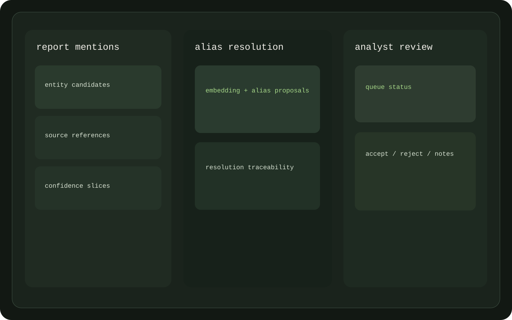
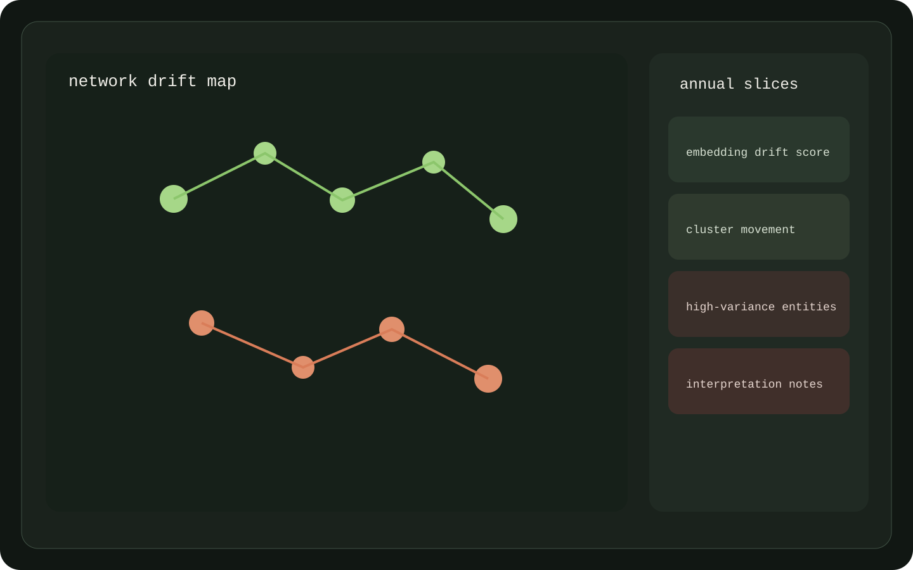

# DPRK document analysis app

DPRK Document Analysis App is a public sanctions-analysis monorepo for document review, entity resolution and network-drift analysis.

The repo keeps method, source lineage and reviewer-facing output in one surface.

- **Status:** Research and demo repo
- **Stack:** Python, FastAPI, browser dashboard, Docker Compose
- **Problem:** Analysis tools often hide provenance and review boundaries behind notebooks or opaque model output.

## Why it matters

- It keeps ingestion, extraction, analyst review and drift analysis in one public repo.
- It documents upstream lineage and release constraints instead of treating the data pipeline as self-contained.
- It shows defense-adjacent analysis software without exposing private data or reviewer identities.

## Repository components

- `apps/dashboard`: analyst-facing review surface
- `packages/entity-resolution`: extraction, alias handling and entity review workflows
- `packages/network-drift`: temporal graph slicing and drift analysis
- `docs/`: landing notes, methodology, lineage and data-policy documentation

## Data provenance and attribution

This project reuses and extends material from [Black Knights and Dark Network](https://github.com/RANDCorporation/black-knights-and-dark-network/) by RAND Corporation. Output lineage keeps source-link attachment and the public repo preserves attribution explicitly.

## Quick start

### Dashboard

- Open `apps/dashboard/index.html`.
- Or run `docker compose up dashboard` and browse to `http://localhost:8080`.

### Toolkit API

- Run `docker compose up toolkit-api`.
- Open API docs at `http://localhost:8000/docs`.

### Pipeline commands

- `docker compose run --rm toolkit-runner er fetch-reports`
- `docker compose run --rm toolkit-runner er extract-mentions --extractor gliner`
- `docker compose run --rm toolkit-runner drift build-slices`

## What to read next

- `docs/landing.md`
- `docs/methodology.md`
- `docs/network-drift-lineage.md`
- `docs/data-policy.md`
