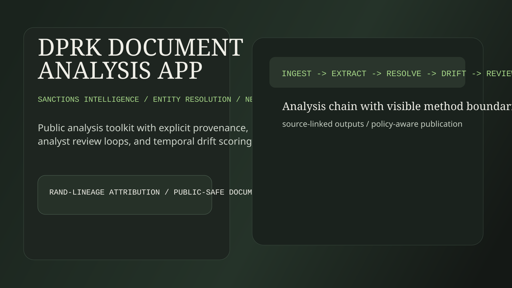

# DPRK Document Analysis App

Public DPRK sanctions-intelligence monorepo with three components: an analyst dashboard, an entity-resolution package, and a network-drift package for temporal graph analysis.

See [docs/landing.md](docs/landing.md) for the full landing walkthrough.

## Why This Exists

This repository packages sanctions-analysis workflows into one reviewable public surface: ingestion and extraction, analyst review loops, and drift analysis over time. It emphasizes method visibility, source lineage, and reproducibility over opaque model output.

## Data Provenance And Attribution

This project reuses and extends [Black Knights and Dark Network](https://github.com/RANDCorporation/black-knights-and-dark-network/) from RAND Corporation.

Attribution principles:

- upstream lineage is explicitly documented
- output rows keep source URL linkage
- processing and review interfaces were rebuilt for public reproducibility

## Quick Start

### Dashboard

- Open `apps/dashboard/index.html`, or run `docker compose up dashboard` and browse to `http://localhost:8080`.

### Toolkit API

- `docker compose up toolkit-api`
- API docs: `http://localhost:8000/docs`

### Pipeline Commands

- `docker compose run --rm toolkit-runner er fetch-reports`
- `docker compose run --rm toolkit-runner er extract-mentions --extractor gliner`
- `docker compose run --rm toolkit-runner drift build-slices`

## Documentation

- [docs/landing.md](docs/landing.md)
- [docs/methodology.md](docs/methodology.md)
- [docs/network-drift-lineage.md](docs/network-drift-lineage.md)
- [docs/data-policy.md](docs/data-policy.md)

## Public Repo Rules

- do not commit raw PDFs
- keep source links attached to processed output lineage
- keep reviewer identifiers pseudonymous
- keep credentials in local env files only
